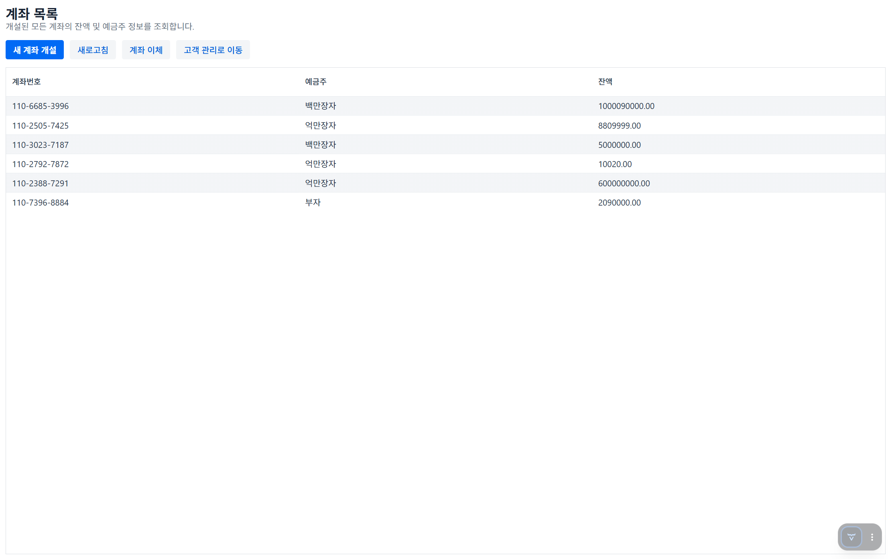
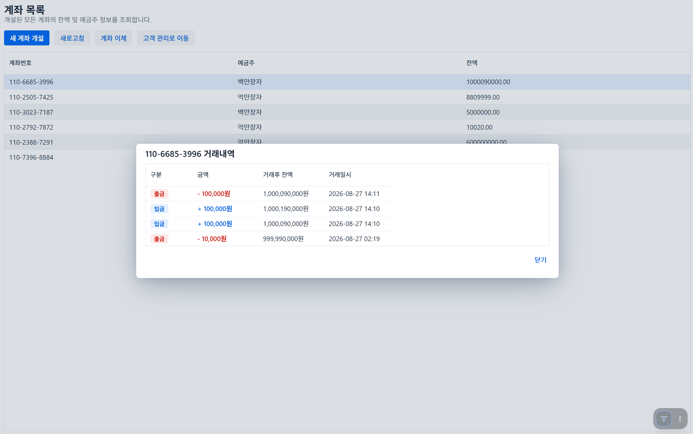
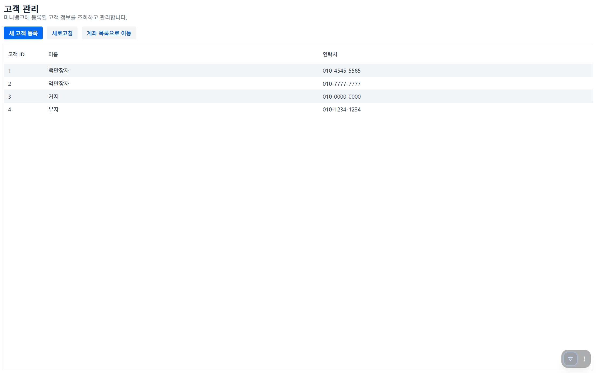
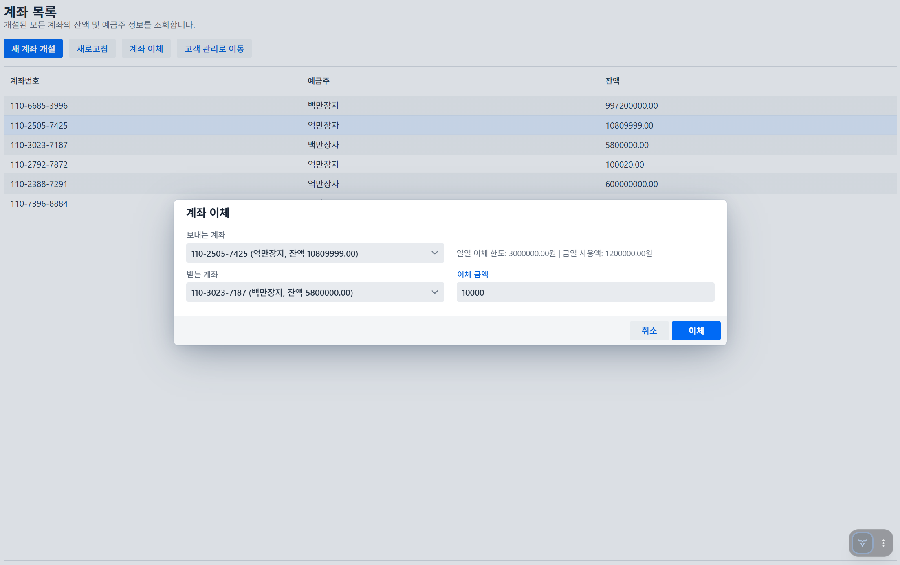

# Spring Boot 이체 서비스 (Transfer Service)

## 개요
2026년 IntelliJ 환경에서 진행되는 Spring Boot 기반 강의 실습 프로젝트입니다.

## 목표
고객, 계좌, 거래 내역 데이터를 다루는 핵심 **금융 서비스**를 구현합니다.

## 주요 기능

* **고객 관리 페이지:** 고객 정보 등록 및 조회

* **계좌 관리 페이지:** 신규 계좌 생성 및 상태 관리

* **계좌 거래 내역 페이지:** 계좌별 입출금 및 이체 기록 조회

* **일일 이체 한도:** 계좌별 이체 한도 설정

